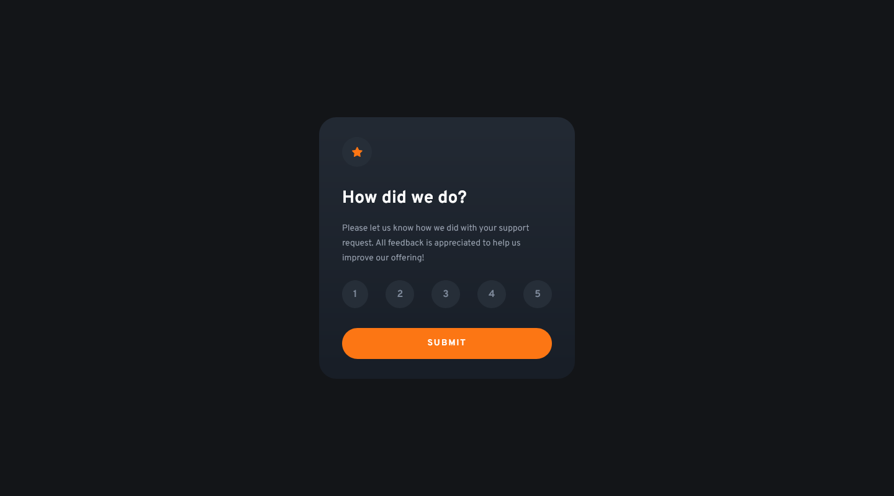
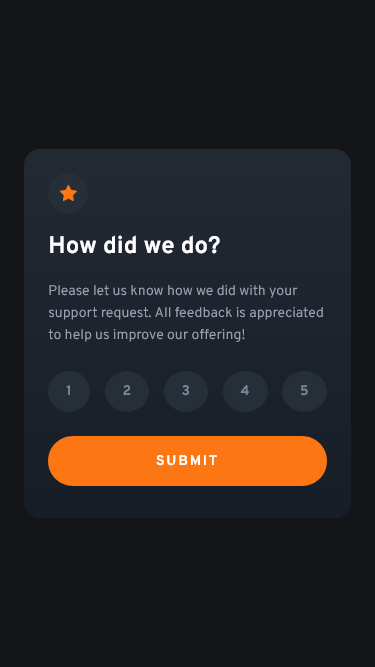

# Frontend Mentor - Interactive rating component solution

This is a solution to the [Interactive rating component challenge on Frontend Mentor](https://www.frontendmentor.io/challenges/interactive-rating-component-koxpeBUmI). Frontend Mentor challenges help you improve your coding skills by building realistic projects.

## Table of contents

- [Overview](#overview)
  - [The challenge](#the-challenge)
  - [Screenshot](#screenshot)
  - [Links](#links)
- [My process](#my-process)
  - [Built with](#built-with)
  - [What I learned](#what-i-learned)
  - [Continued development](#continued-development)
  - [Useful resources](#useful-resources)
- [Author](#author)
- [Acknowledgments](#acknowledgments)

## Overview

### The challenge

Users should be able to:

- View the optimal layout for the app depending on their device's screen size
- See hover states for all interactive elements on the page
- Select and submit a number rating
- See the "Thank you" card state after submitting a rating

### Screenshot

### Links

- Solution URL: [Project GitHub](https://github.com/joanFaseDev/interactive-rating-component)
- Live Site URL: [Project hosted through Vercel](https://interactive-rating-component-three-gold.vercel.app/)

## My process

### Built with

- Semantic HTML5 markup
- CSS custom properties
- Flexbox
- CSS Grid
- CUBE CSS

### What I learned

- This project was about building some confidence with the CUBE CSS methodology. I can't really call it a success because i ended up with more questions and only a handful of answers along the way.

That being said, i feel more accustomed with some part of the methodology like the utility classes and the blocks. I have difficulties with the composition and exception parts mainly because i don't know exactly at what point am i supposed to work on them. I imagine most of my troubles come from my lack of experience. Building other projects will probably help me better understand how am i supposed to apply the cube and in what order.

- This was my first project on Frontend Mentor using JavaScript. Thankfully, it was mainly DOM manipulation which is great because it's basically the extent of my knowledge with the language. I don't think i learned a lot from this project but it definitely helped me remember quite a few things (i didn't use JS in a long time)!

### Continued development

- On this project, i was so focused on cube methodology and layout that i totally neglected HTML's semantic tags and ended up using a lot of divs. That's definitely something i'll be more careful of in the future.
- Also, i'm gonna keep using CUBE CSS (or at least i'll used what i understand of the cube... which is not much at the moment!) because even if i don't think that this is that powerful as a metholodogy, i still like the thought process behind it. And i think it's better to stick with a naming convention you like than to focus on a more popular one that you don't.

### Useful resources

- [Andy Bell's article](https://piccalil.li/blog/cube-css/) - An article introducing the CUBE CSS philosophy written by its creator, Andy Bell.
- [Official CUBE CSS Website](https://cube.fyi/#what-does-cube-css-stand-for) - Copy / Paste a lot of what's written in Andy Bell's article but add a few interesting things too.

## Author

- Frontend Mentor - [@joanFaseDev](https://www.frontendmentor.io/profile/joanFaseDev)

## Acknowledgments

- Andy Bell for its methodology (even if i butchered it while trying to use it) and Kevin Powell for explaining it.
